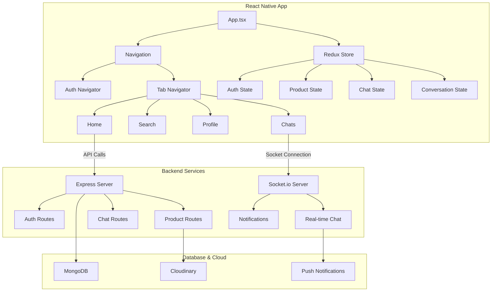
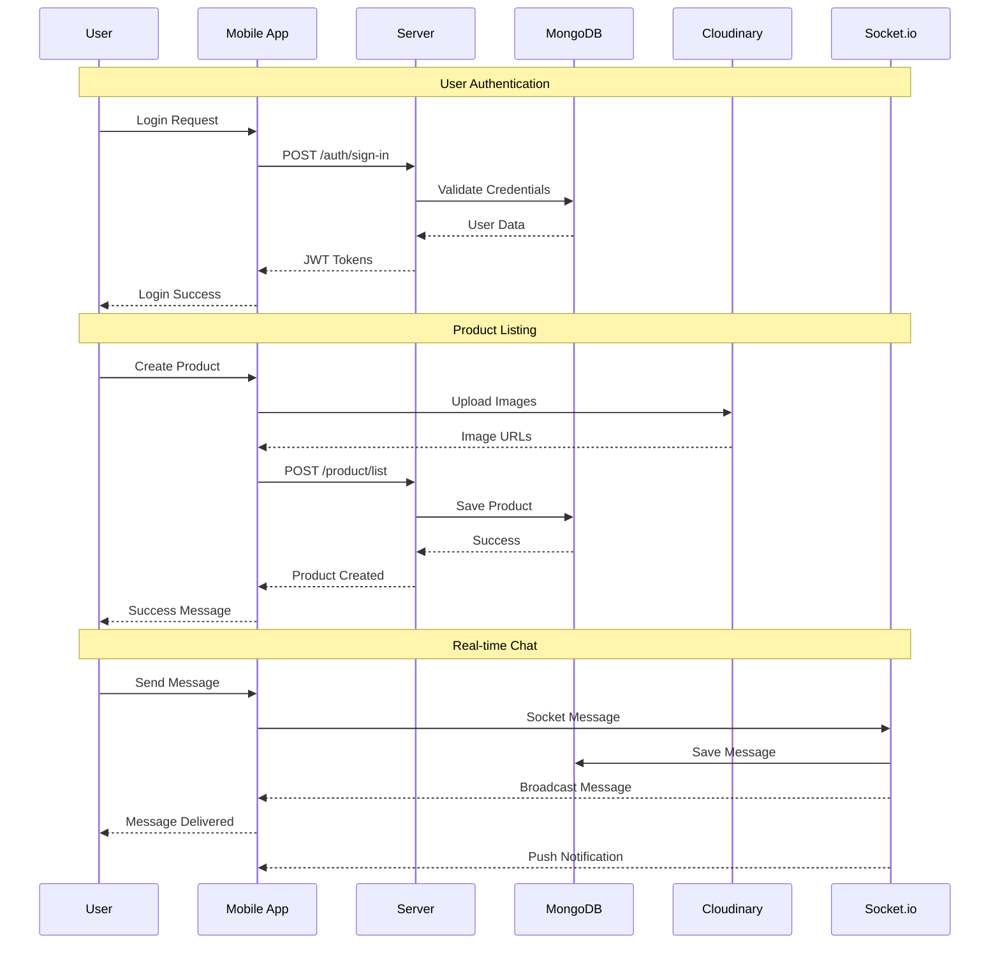
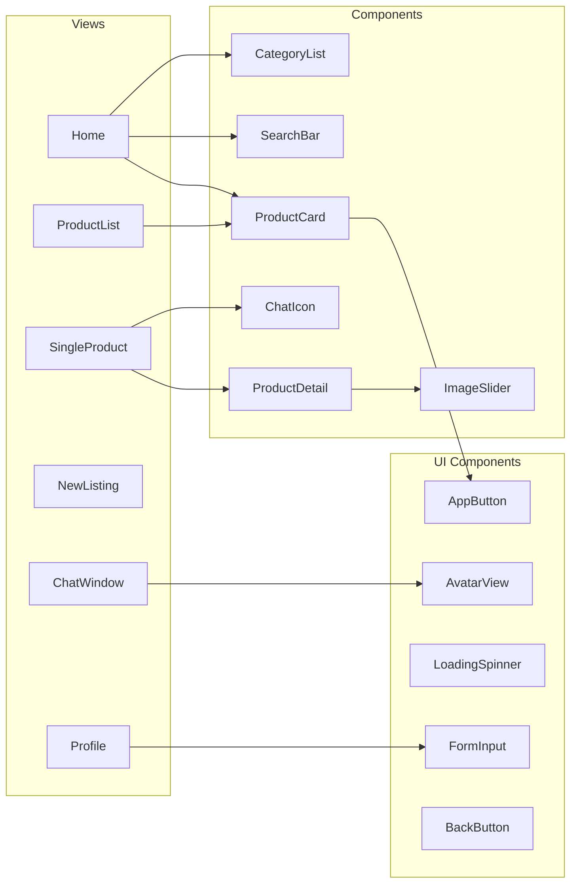

# 🛒 ChoTot - Mobile Marketplace Application

A comprehensive mobile marketplace application built with React Native and Node.js, featuring real-time chat, product listings, and modern mobile development practices.

## 🔧 Tech Stack

### Frontend (Mobile App)
[](https://reactnative.dev/)
[](https://www.typescriptlang.org/)
[](https://expo.dev/)
[](https://redux-toolkit.js.org/)


### Backend
[](https://nodejs.org/)
[](https://expressjs.com/)
[](https://www.typescriptlang.org/)
[](https://socket.io/)
[](https://www.mongodb.com/)
[](https://jwt.io/)

### Cloud Services & Tools
[](https://cloudinary.com/)
[](https://docs.expo.dev/push-notifications/overview/)
[](https://axios-http.com/)
[](https://github.com/jquense/yup)


## 🙏 Acknowledgments

This project was developed by a dedicated team of three students as part of our Mobile Development course:

### 👨‍💻 Team Members & Contributions

**🚀 [bunchangon711](https://github.com/bunchangon711) 
- **Real-time Chat System**: Designed and implemented the complete Socket.io-based messaging system with room management, authentication, and reconnection logic
- **Socket.io Integration**: Developed bidirectional real-time communication with message broadcasting, typing indicators, and push notifications
- **Mobile App Features**: Implemented chat interfaces, image sharing, emoji support, and message deletion functionality
- **Performance Optimization**: Added automatic reconnection, error handling, and efficient state management with Redux Toolkit
- **Documentation**: Comprehensive project documentation, API specifications, and technical implementation details
- Mobile UI/UX design and implementation
- Profile management and user verification
- Product management and image upload

**📱 BinhMinhPTIT - Mobile Features Developer**
- **Database Design**: Created conversation models, chat schemas, and implemented efficient message storage and retrieval
- **Backend Architecture**: Built the Express.js server with MongoDB integration, JWT authentication, and API endpoints
- Authentication system implementation
- Mobile-specific optimizations and testing

**🎨 THOMASS8888 - Frontend Specialist**
- Product listing and search functionality
- User interface components and navigation
- State management and data flow optimization


## 🌟 Features

### 📱 Mobile-First Design
- **Cross-Platform**: Built with React Native for iOS and Android
- **Responsive UI**: Adaptive layouts for different screen sizes
- **Modern Interface**: Clean, intuitive design with smooth animations
- **Native Performance**: Optimized for mobile devices

### 🔐 Authentication & User Management
- **Secure Registration**: Email verification with token-based authentication
- **JWT Authentication**: Stateless authentication with refresh tokens
- **Profile Management**: Avatar upload, profile editing, and verification badges
- **Password Recovery**: Secure password reset with email verification
- **Role-Based Access**: Different permissions for buyers and sellers

### 🛍️ Product Management
- **Product Listings**: Create detailed product listings with multiple images
- **Category System**: Organized into 10+ categories (Electronics, Fashion, etc.)
- **Image Upload**: Multiple image upload with Cloudinary integration
- **Product Search**: Advanced search with category filtering and text search
- **Price Range Filters**: Dynamic price filtering with slider controls
- **Product Details**: Rich product information with seller verification

### 💬 Real-Time Chat System
- **Socket.io Integration**: Real-time messaging between buyers and sellers
- **Image Sharing**: Send and receive images in conversations
- **Emoji Support**: Built-in emoji picker for expressive messaging
- **Message Status**: Read receipts and message delivery status
- **Push Notifications**: Real-time notifications for new messages
- **Chat Management**: Message deletion and conversation history

### 🔍 Search & Discovery
- **Smart Search**: Search products by name, description, and category
- **Category Browsing**: Browse products by organized categories
- **Latest Products**: Discover newest listings on the platform
- **Product Recommendations**: Trending and popular items
- **Filter Options**: Advanced filtering by price, category, and condition

### 📊 User Experience Features
- **Navigation**: Tab-based navigation with stack navigation
- **Loading States**: Professional loading indicators and empty states
- **Error Handling**: Comprehensive error handling with user-friendly messages
- **Offline Support**: Basic offline functionality with data caching
- **Pull-to-Refresh**: Refresh data with intuitive pull gestures

### 🔔 Notification System
- **Push Notifications**: Real-time notifications for messages and updates
- **In-App Notifications**: Toast notifications for user actions
- **Chat Badges**: Unread message counters and indicators
- **Background Sync**: Message synchronization when app returns to foreground

## 🏗️ Architecture

### Mobile App Architecture


### Data Flow Diagram


### Component Structure


## 📊 Database Schema

### Core Collections
- **Users**: User profiles, authentication data, and verification status
- **Products**: Product listings with images, categories, and seller information
- **Conversations**: Chat conversations between users
- **AuthVerificationTokens**: Email verification tokens
- **PasswordResetTokens**: Password reset verification tokens
- **WishLists**: User wishlist items (future feature)

### Product Categories
- Automotive
- Beauty & Personal Care
- Books
- Electronics
- Fashion
- Fitness
- Home & Kitchen
- Sports & Outdoors
- Tools & Home Improvement
- Toys & Games

## 🚀 Getting Started

### Prerequisites
- **Node.js**: Version 16 or higher
- **npm** or **yarn**: Package manager
- **MongoDB**: Local installation or MongoDB Atlas
- **Expo CLI**: For React Native development
- **Android Studio** or **Xcode**: For device testing

### Backend Setup

1. **Clone the repository**
   ```bash
   git clone https://github.com/bunchangon711/Mobile_ChoTot
   cd ChoTot/server
   ```

2. **Install dependencies**
   ```bash
   npm install
   ```

3. **Environment Configuration**
   Create a `.env` file in the server directory:
   ```env
   PORT=8000
   MONGODB_URI=mongodb://localhost:27017/chotot
   JWT_SECRET=your_jwt_secret_key
   CLOUDINARY_CLOUD_NAME=your_cloudinary_name
   CLOUDINARY_API_KEY=your_cloudinary_key
   CLOUDINARY_API_SECRET=your_cloudinary_secret
   VERIFICATION_LINK=http://localhost:8000/verify
   PASSWORD_RESET_LINK=http://localhost:8000/reset-password
   ```

4. **Start the server**
   ```bash
   npm run dev
   ```

### Mobile App Setup

1. **Navigate to frontend directory**
   ```bash
   cd ../front-end
   ```

2. **Install dependencies**
   ```bash
   npm install
   ```

3. **Configure API endpoint**
   Update `app/api/client.ts` with your server URL:
   ```typescript
   export const baseURL = __DEV__ 
     ? "http://10.0.2.2:8000"  // Android emulator
     : "https://your-production-url.com";
   ```

4. **Start the development server**
   ```bash
   npx expo start
   ```

5. **Run on device**
   - **Android**: `npx expo run:android`
   - **iOS**: `npx expo run:ios`
   - **Expo Go**: Scan QR code with Expo Go app

### Production Deployment

#### Backend Deployment
```bash
# Build TypeScript
npm run build

# Start production server
npm start
```

#### Mobile App Deployment
```bash
# Build for production
npx expo build:android
npx expo build:ios

# Or using EAS Build
npx eas build --platform all
```

## 📱 API Endpoints

### Authentication
- `POST /auth/sign-up` - User registration
- `POST /auth/sign-in` - User login
- `POST /auth/verify` - Email verification
- `POST /auth/refresh-token` - Refresh access token
- `POST /auth/sign-out` - User logout
- `GET /auth/profile` - Get user profile
- `POST /auth/update-avatar` - Update profile picture
- `POST /auth/forget-pass` - Request password reset

### Products
- `GET /product/latest` - Get latest products
- `GET /product/by-category/:category` - Get products by category
- `GET /product/search` - Search products
- `GET /product/detail/:id` - Get product details
- `POST /product/list` - Create new product listing
- `PATCH /product/:id` - Update product
- `DELETE /product/:id` - Delete product
- `GET /product/listings` - Get user's listings

### Chat & Conversations
- `GET /conversation/with/:peerId` - Get or create conversation
- `GET /conversation/chats/:conversationId` - Get chat history
- `GET /conversation/last-chats` - Get recent conversations
- `PATCH /conversation/seen/:conversationId/:peerId` - Mark messages as read
- `DELETE /conversation/message/:conversationId/:messageId` - Delete message

### Socket Events
- `join_room` - Join conversation room
- `leave_room` - Leave conversation room
- `send_message` - Send chat message
- `new_message` - Receive new message
- `chat:seen` - Message read receipt
- `chat:typing` - Typing indicator

## 🔐 Security Features

- **JWT Authentication**: Secure token-based authentication with refresh tokens
- **Password Encryption**: Bcrypt hashing for password security
- **Input Validation**: Comprehensive validation using Yup schemas
- **File Upload Security**: Secure image upload with type validation
- **Socket Authentication**: JWT-based socket connection authentication
- **Rate Limiting**: API rate limiting for security
- **CORS Configuration**: Secure cross-origin resource sharing
- **Environment Variables**: Sensitive data protection

## 📈 Key Highlights

### Mobile Development Best Practices
- **Component Architecture**: Reusable, modular components
- **State Management**: Redux Toolkit for predictable state updates
- **Navigation**: React Navigation with type-safe routing
- **Performance**: Optimized list rendering and image loading
- **User Experience**: Smooth animations and responsive design

### Real-Time Features
- **Socket.io Integration**: Bidirectional real-time communication
- **Message Synchronization**: Automatic message syncing across devices
- **Push Notifications**: Native push notifications for engagement
- **Offline Support**: Basic offline functionality with data persistence

### Modern Development Practices
- **TypeScript**: Type-safe development for better code quality
- **Async/Await**: Modern asynchronous programming patterns
- **Error Boundaries**: Comprehensive error handling
- **Code Splitting**: Modular architecture for maintainability
- **API Abstraction**: Clean API layer with axios interceptors


## 📱 Mobile Features

### React Native Specific
- **Expo Integration**: Managed workflow with Expo SDK
- **Native Modules**: Camera, image picker, notifications
- **Platform Adaptation**: iOS and Android specific optimizations
- **Performance Optimization**: FlatList for large datasets
- **Memory Management**: Efficient image loading and caching

### User Interface
- **Material Design**: Android-style components
- **iOS Guidelines**: Native iOS feel and interactions
- **Accessibility**: Screen reader support and accessibility labels
- **Dark Mode**: Theme support (future feature)
- **Internationalization**: Multi-language support ready

## 🤝 Contributing

1. Fork the repository
2. Create a feature branch (`git checkout -b feature/AmazingFeature`)
3. Commit your changes (`git commit -m 'Add some AmazingFeature'`)
4. Push to the branch (`git push origin feature/AmazingFeature`)
5. Open a Pull Request


### 🏆 Key Achievements
- **Real-time Communication**: Successfully implemented a production-ready chat system with Socket.io
- **Mobile-First Design**: Built a responsive, cross-platform mobile application using React Native
- **Scalable Architecture**: Designed a modular, maintainable codebase with modern development practices
- **Modern Tech Stack**: Integrated cutting-edge technologies including TypeScript, Redux Toolkit, and Cloudinary
- **Security Implementation**: JWT-based authentication with refresh tokens and secure API endpoints

### 📚 Learning Outcomes
Through this project, we gained hands-on experience with:
- **Full-stack Development**: End-to-end application development from database to mobile interface
- **Real-time Technologies**: Socket.io implementation for instant messaging and notifications
- **Mobile Development**: React Native, Expo, and cross-platform mobile app optimization
- **Cloud Integration**: Cloudinary for image management and MongoDB Atlas for database hosting
- **Modern JavaScript/TypeScript**: Advanced ES6+ features, async/await patterns, and type safety

---

## 🛠️ Technical Implementation Details

### Socket.io Real-Time Chat
- **Room Management**: Users join conversation-specific rooms
- **Message Broadcasting**: Real-time message delivery to all participants
- **Authentication**: JWT-based socket authentication
- **Reconnection Logic**: Automatic reconnection with exponential backoff
- **Error Handling**: Comprehensive error handling for connection issues

### Image Management
- **Multiple Upload**: Support for multiple image uploads per product
- **Cloud Storage**: Cloudinary integration for image optimization
- **Compression**: Automatic image compression for mobile optimization
- **Caching**: Efficient image caching for performance

### State Management
- **Redux Toolkit**: Modern Redux with less boilerplate
- **Persistence**: State persistence for offline support
- **Normalization**: Efficient data structure for complex state
- **Middleware**: Custom middleware for API calls and logging

### Performance Optimizations
- **Lazy Loading**: Component and route-based code splitting
- **Memoization**: React.memo and useMemo for performance
- **Virtual Lists**: FlatList for efficient rendering of large datasets
- **Image Optimization**: Optimized image loading and display

---

⭐ **Star this repository if you found it helpful!**

Built with ❤️ using React Native, Node.js, and modern mobile development practices
